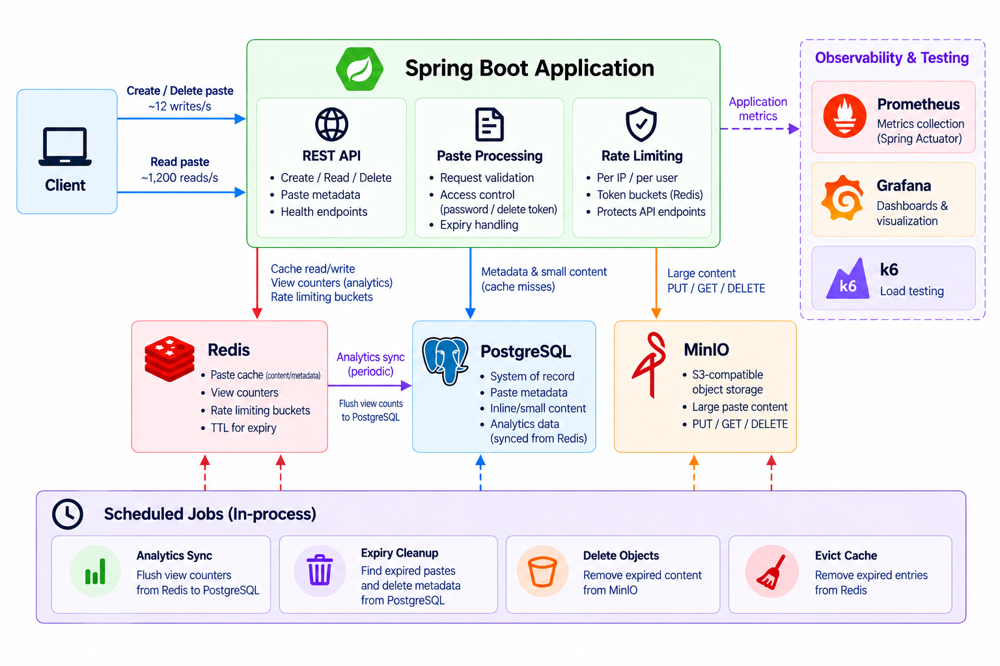

# CuraPaste

CuraPaste is a paste-sharing backend where users can create, share, and manage text snippets through short URLs.

I built it as a hands-on system design project to go beyond designing systems on paper and actually implement the trade-offs involved in building a **read-heavy backend**.

The goal was to understand **why** components like Redis, PostgreSQL, object storage, caching, asynchronous processing, resilience patterns, and distributed locking are used — and what trade-offs they introduce.

## Tech Stack

- **Java 21 + Spring Boot** — REST API and application logic
- **PostgreSQL** — durable data and system of record
- **Redis** — caching, analytics counters, and rate limiting
- **MinIO / S3** — storage for larger paste content
- **Flyway** — database migrations
- **ShedLock** — distributed locking for scheduled jobs
- **Resilience4j** — circuit breakers and retries
- **Prometheus + Grafana** — monitoring and metrics
- **K6** — load testing
- **Docker Compose** — local infrastructure
- **Frontend** — Yet to be implemented in Next.js

## Features

- Create pastes with short URL-friendly IDs
- Optional password protection
- Expiring pastes
- Burn-after-read pastes
- Creator deletion using a delete token
- Redis cache-aside read path
- Hybrid PostgreSQL + object storage
- View analytics with Redis aggregation
- Optional Redis-backed rate limiting
- Background expiry cleanup
- Resilient dependency handling (circuit breakers and retry strategies)
- Multi-instance safe scheduled jobs (using ShedLock)
- Prometheus metrics and K6 load testing

## System Design Highlights

### Read-heavy architecture

Redis sits in front of PostgreSQL and MinIO on the read path, keeping repeated reads away from the durable stores.

### Hybrid storage

Small pastes stay in PostgreSQL while larger content is stored in MinIO. PostgreSQL keeps the metadata and object location.

### Eventually consistent analytics

Views are incremented in Redis and periodically synchronized to PostgreSQL instead of writing to the database on every read.

### Resilience

Redis and object storage use circuit breakers/retries where appropriate, with database fallbacks for cache misses.

### Lifecycle management

Expiry, burn-after-read, and creator deletion each have different consistency and cleanup requirements across PostgreSQL, Redis, and MinIO.

### Distributed scheduling

Scheduled jobs use ShedLock with PostgreSQL so multiple application instances don't execute the same scheduled job simultaneously.

## Architecture

## Load Test

A local K6 read-heavy workload targeting **1,200 reads/sec + 12 writes/sec** was used to evaluate the system.

Recorded run:

- **36,463 requests**
- **0% HTTP failures**
- **p95: 142 ms**
- **~800 requests/sec aggregate**

 

> This is a local benchmark and not a claim of production capacity.
>
> The results provide an initial indication that the proposed 1,200 reads/sec target is plausible with proper cloud infrastructure and horizontal scaling. A production deployment would require dedicated benchmarking and capacity testing under realistic resource and network conditions.

## Project Status

CuraPaste is primarily a **system design / backend learning project**.

The focus is on understanding and implementing backend architecture and trade-offs rather than building a full production Pastebin clone.
